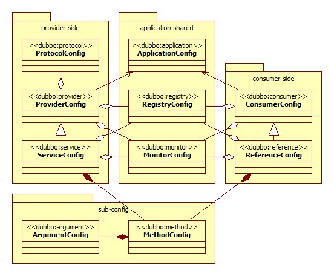

## Dubbo笔记
Apache Dubbo是一个高性能的基于java的开源的RPC框架。

### ·Dubbo系统架构

### ·配置关系图

### ·Consumer端与Provider端配置项
#### 公共配置
|配置项|说明|类|说明|
|---|---|---|---|
|dubbo:application|应用信息配置|com.alibaba.dubbo.config.ApplicationConfig||
|dubbo:registry|注册中心配置|com.alibaba.dubbo.config.RegistryConfig|同时如果有多个不同的注册中心，可以声明多个 dubbo:registry 标签，并在 dubbo:service 或 dubbo:reference 的 registry 属性指定使用的注册中心。|
|dubbo:monitor|监控中心配置|com.alibaba.dubbo.config.MonitorConfig||

#### Provider端独有配置
|配置项|说明|类|说明|
|---|---|---|---|
|dubbo:protocol|服务提供者协议配置|com.alibaba.dubbo.config.ProtocolConfig|同时，如果需要支持多协议，可以声明多个 dubbo:protocol 标签，并在 dubbo:service 中通过 protocol 属性指定使用的协议。|
|dubbo:provider|服务提供者缺省值配置|com.alibaba.dubbo.config.ProviderConfig|同时该标签为 dubbo:service 和 dubbo:protocol 标签的缺省值设置。|
|dubbo:service|服务提供者暴露服务配置|com.alibaba.dubbo.config.ServiceConfig||

#### Consumer端独有配置
|配置项|说明|类|说明|
|---|---|---|---|
|dubbo:consumer|服务消费者缺省值配置|com.alibaba.dubbo.config.ConsumerConfig|同时该标签为 dubbo:reference 标签的缺省值设置。|
|dubbo:reference|服务消费者引用服务配置|com.alibaba.dubbo.config.ReferenceConfig||

#### dubbo:service与dubbo:reference的子配置
|配置项|说明|类|说明|
|---|---|---|---|
|dubbo:method|方法级配置|com.alibaba.dubbo.config.MethodConfig|同时该标签为 dubbo:service 或 dubbo:reference 的子标签，用于控制到方法级。|

#### dubbo:method的子配置
|配置项|说明|类|说明|
|---|---|---|---|
|dubbo:argument|方法参数配置|com.alibaba.dubbo.config.ArgumentConfig|该标签为 dubbo:method 的子标签，用于方法参数的特征描述|

### ·配置项优先级
> reference method > service method > reference > service > consumer > provider

